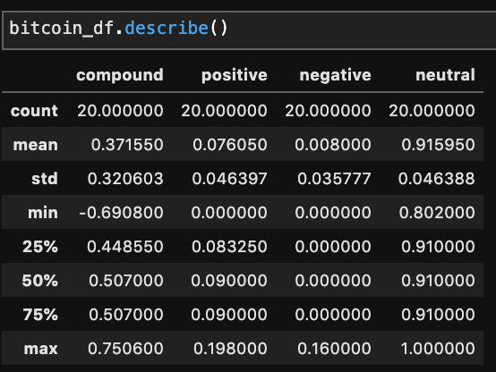
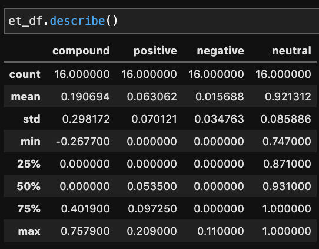
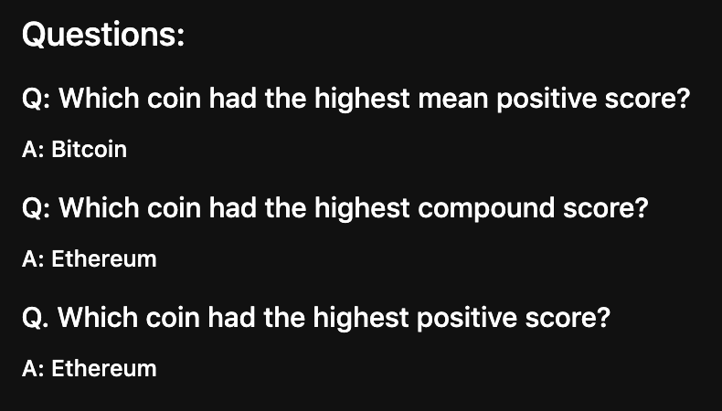
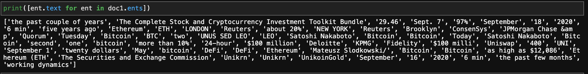

# NPL Homework 12 

Analysis code: [Notebook](https://github.com/jcurvone/npl_hw12/blob/master/Sentiment.ipynb)

### Sentiment Analyzer Results

BITCOIN 

ETHEREUM 

#### Answers 

### Frequency counter & Word Clouds 

BITCOIN 

ETHEREUM 

### Entities Plot 

BITCOIN 

ETHEREUM
